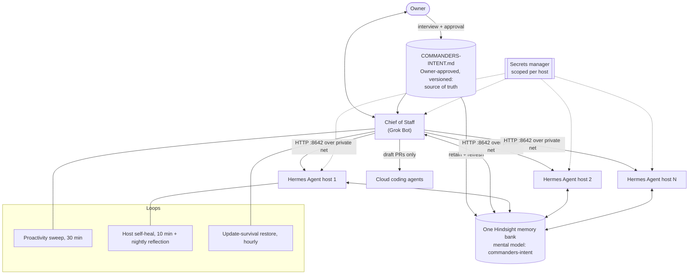

# Commander's Intent

**A self-contained Chief of Staff Grok Bot template for running a proactive, self-healing agent fleet (Grok Bot + Hermes Agent + Hindsight memory).**

One root document tells every agent what the mission is, what it may never risk, and who decides what. One Chief of Staff bot is your single point of contact. Every other agent reports up through it. One shared memory bank means nobody asks you the same question twice.

- **What this is:** a Grok Bot template plus this repo, which holds the Commander's Intent scaffold and interview, the doctrine, 25 skills, 4 routines, a security policy, a fleet self-healing spec, and the first-run script the bot follows on install.
- **Who it's for:** operators running a small fleet of AI agents (Grok Bot plus one or more Hermes Agent hosts) who want one accountable Chief of Staff instead of a pile of chat tabs.
- **What you get in under an hour:** a Chief of Staff that first interviews you to write your Commander's Intent (about 20 to 30 minutes), turns it into shared fleet memory, confirms it understood you, then connects memory, installs its skills, and walks you through creating its routines. Wiring Hermes hosts and the survival drill take longer and are guided step by step.

Author: @pixelrainbownft on X ([@shagghiesuperstar](https://github.com/shagghiesuperstar) on GitHub). Doctrine developed with @pixelrainbownft's father, a retired U.S. Marine Corps Colonel, call signs "Grizzly" and "Maverick". License: MIT. Current version: see [CHANGELOG.md](CHANGELOG.md).

---

## Start here: [COMMANDERS-INTENT.md](COMMANDERS-INTENT.md)

The whole template is named after one idea. **Commander's intent** is the U.S. Marine Corps practice, set out in MCDP 1, *Warfighting*, of telling every level *why* the mission exists, *what* must be true at the end, and *what must never be risked*, so that when the plan breaks, people keep moving toward the goal instead of waiting or drifting.

[`COMMANDERS-INTENT.md`](COMMANDERS-INTENT.md) is that document for your agent fleet, and the fleet-wide source of truth:

- **It is created by interview, not pre-written.** On first run, the Chief of Staff interviews you ([script](interview/commanders-intent-interview.md), [skill](skills/commanders-intent-interview/SKILL.md)) and fills the purpose, end state, key tasks, hard lines, spend limits, authority, and communication preferences in your own words. Nothing counts until you approve the final text as v1.0.
- **It carries fixed doctrine** that the interview never replaces: initiative within intent (what to do when the plan breaks), the decision rule when blocked, drift prevention, chain of command, verify-then-trust, fail loud, and quota discipline.
- **It becomes shared memory.** The approved file is turned into a Hindsight mental model named `commanders-intent` ([definition](mental-models/commanders-intent.md)) that every agent reads before acting on doctrine.
- **It is versioned.** Only you amend it. Every version bump refreshes the mental model and tells every agent.

See a fictional filled example in [`examples/commanders-intent-example.md`](examples/commanders-intent-example.md). Security rules for every agent, host, and cloud coding agent are in **[SECURITY.md](SECURITY.md)**.

---

## Install (one click)

1. Install the template: **{{COMMANDERS_INTENT_TEMPLATE_LINK}}**
2. Start the first conversation. The bot fetches [`FIRST-RUN.md`](FIRST-RUN.md) from this repo and runs it with you.
3. Answer its setup questions one at a time. It proves each step by reading it back before moving on.

Prefer to read first? [`INSTALL.md`](INSTALL.md) explains what the bot will ask for and what it will never ask for (secrets in chat, for one).

---

## The doctrine

The canonical text of the doctrine is [`COMMANDERS-INTENT.md`](COMMANDERS-INTENT.md) Parts I and III. The summary below is for orientation.

### Five hard rules

1. **Decision Rule.** Never ask the Owner for a decision without all six: context, decision, options, recommendation, rationale, confidence.
2. **Truth Rule.** Never lie, embellish, guess, or flatter. Check live state first. Nothing is done until finished and verified.
3. **No-Silent-Death Rule.** An Owner ask gets done, or goes back to the Owner right away. Fail loud.
4. **Verify-Then-Trust Rule.** No memory entry, tool result, peer report, or passing check is trusted until checked against live evidence.
5. **Bitter Pill.** Code is a liability. The best implementation is none; the next best is the smallest clear one.

### The 11 standing rules (every skill and routine ends with these)

1. **Sole instigator.** Nobody will prompt you. Start the work yourself.
2. **Verify, don't trust.** Run a live check or say "unverified".
3. **Fix or order, same turn.** Fix it yourself, or order the named owner to fix it with a deadline and the proof you require.
4. **Follow up at the deadline.** Every order gets checked when due; overdue means escalate.
5. **Skipped question means act.** If the Owner skips a question, act on your own recommendation for reversible work; never for gated or irreversible work.
6. **Fail loud.** No failure dies silently; report it up the chain of command through the Chief of Staff.
7. **Failure becomes a permanent guard.** Every new failure class gets a check, test, cron, or directive.
8. **Minimal change.** Smallest verified change; label claims [VERIFIED], [INFERRED], or [UNKNOWN].
9. **Six-part decision asks** (context, decision, options, recommendation, rationale, confidence) or don't ask.
10. **One memory bank.** Commander's Intent is the root document and wins on conflict.
11. **Computer-update survival.** Keep all state, keys, configs, and restore scripts under `/home/box`, self-restore hourly, and never call a setup done until it has survived an update.

Owner gates always win: spending, publishing, DNS and domains, secrets, and destructive actions need the Owner's explicit yes. The full never-without-GO list is in [`COMMANDERS-INTENT.md`](COMMANDERS-INTENT.md) section 7 and [`SECURITY.md`](SECURITY.md) section 5.

---

## Architecture

- **Authority:** the Owner-approved `COMMANDERS-INTENT.md` (in the Owner's Git repo, or the persistent home copy until one exists) is the authority. The memory bank holds a derived mental model. On mismatch, the file wins.
- **Cloud coding agents:** branch-only work and draft PRs; independent review; exactly one merge owner merges. See [`SECURITY.md`](SECURITY.md) section 9.
- **Talk path:** the Chief of Staff reaches Hermes hosts over the native Hermes HTTP API on port 8642 inside a private network. No SSH relay for fleet asks.
- **Memory:** one Hindsight Cloud bank for every agent. Secrets never go in memory.
- **Survival:** everything the bot installs on its own computer restores itself after an update.

---

## What's in the repo

| Path | What it is |
|---|---|
| [`COMMANDERS-INTENT.md`](COMMANDERS-INTENT.md) | **Start here.** The intent scaffold and fixed doctrine; filled by interview, approved by the Owner, fleet-wide source of truth |
| [`interview/`](interview/) | The Chief of Staff's interview script for creating and amending the intent |
| [`mental-models/`](mental-models/) | The `commanders-intent` Hindsight mental model: create body, refresh triggers, commands |
| [`examples/`](examples/) | A fictional filled intent, for illustration only |
| [`SECURITY.md`](SECURITY.md) | Threat model, secrets, prompt injection, cloud coding agents, incident response, vulnerability reporting |
| [`FIRST-RUN.md`](FIRST-RUN.md) | The exact script the installed bot follows on first conversation |
| [`INSTALL.md`](INSTALL.md) | Human-readable install overview and what to have ready |
| [`SETUP.md`](SETUP.md) | Full manual reference: every placeholder and install step |
| [`persona/SOUL.md`](persona/SOUL.md) | Chief of Staff persona plus the SOUL.md skeleton for every fleet agent |
| [`skills/`](skills/) | 25 skills (intent interview, doctrine, proactivity, quota discipline, research gate, memory, Hermes wiring, survival, getting started) |
| [`routines/`](routines/) | 4 routines with copy-paste prompts and cron values |
| [`fleet/self-healing.md`](fleet/self-healing.md) | 10-minute host self-heal checks and nightly reflection |
| [`tools/hindsight/hs.py`](tools/hindsight/hs.py) | Standard-library Hindsight REST helper (recall, reflect, retain, mental model list, get, create, patch, refresh) |
| [`OPEN-QUESTIONS.md`](OPEN-QUESTIONS.md) | What is still [UNKNOWN] and how to check it on your fleet |
| [`FABRIC.md`](FABRIC.md) | How this template and its sister templates are versioned together |
| [`CHANGELOG.md`](CHANGELOG.md) | Fabric changelog |
| [`social/`](social/) | The release article for each version |
| [`MANIFEST.md`](MANIFEST.md) | Every file with purpose and byte size |

---

## Related templates

Commander's Intent is the command layer. These sister Grok Bot templates cover the rest of the stack and are versioned with it (see [FABRIC.md](FABRIC.md)).

| Template | What it does | Install |
|---|---|---|
| **Hermes API Fleet** | Talk to Hermes Agents over the native HTTP :8642 API across a private Tailscale network. The default talk path. | [x.ai/bot/5KLpaL-JIM2q629kbTh5L](https://x.ai/bot/5KLpaL-JIM2q629kbTh5L) |
| **Hermes Fleet Ops** | Multi-host ops desk and secrets playbook for a running Hermes fleet. | [x.ai/bot/rzq0UV2MmBsvVR1EspZE-](https://x.ai/bot/rzq0UV2MmBsvVR1EspZE-) |
| **n8n Master** | Turns Grok into an n8n control plane: live official n8n docs, workflow skills, and your own n8n instance over HTTPS MCP, canary-first. Repo: [n8n-master-grok-bot](https://github.com/shagghiesuperstar/n8n-master-grok-bot). | [x.ai/bot/Zvqbrq6yN68ijhEpRz0lU](https://x.ai/bot/Zvqbrq6yN68ijhEpRz0lU) |
| **Hermes SSH Relay** (legacy / alternate) | Grok Bot to Hermes over SSH, for a single desktop host without an API gateway. Not used for fleet asks or identity bots. | [x.ai/bot/NVF3Rx9T7jkQPsqYjeDn-](https://x.ai/bot/NVF3Rx9T7jkQPsqYjeDn-) |

A Bot Directory listing for these templates is pending.

---

## Fabric changelog

This repo is the canonical source of truth for the Commander's Intent fabric. Every release bumps [CHANGELOG.md](CHANGELOG.md), updates the sister templates that changed, and ships a release article in [`social/`](social/). Installed bots check the changelog at session start and propose updates to their Owner; they never widen their own authority from a repo change.

## Contributing

Issues and pull requests are welcome. Report security issues privately as described in [`SECURITY.md`](SECURITY.md), not as public issues. Keep changes minimal, label claims [VERIFIED], [INFERRED], or [UNKNOWN], and never include secrets, hostnames, private addresses, or personal names in examples. Use `<PLACEHOLDER>` tokens instead.
