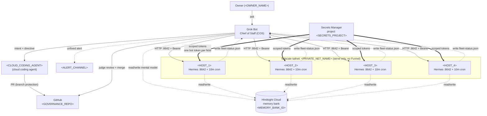

# Fleet Reference Architecture

## Plain-English summary
The Owner talks only to the Grok Bot Chief of Staff. COS talks only to Hermes agents over the private Tailscale tailnet on HTTP :8642. All agents share one Hindsight Cloud memory bank. Secrets flow in from a secrets manager, scoped per host. Code work goes through cloud coding agents as PRs against a GitHub governance repo. Each host runs a 10-minute self-healing cron that writes a status file COS reads. That is the whole fleet.

## Diagram

## Component table

| Component | Vendor | Role | Trust boundary | Failure mode | Guard |
|---|---|---|---|---|---|
| Grok Bot (COS) | Grok Bot | Chief of Staff; sole Owner contact; consolidates every agent report | Owner-facing (outside tailnet) and orchestrator (inside) | COS silent, missed ask, stale intent commit, Owner blocked | Owner may interrupt at any time; cron monitors; alert channel on degraded state; intent commit SHA pinned |
| Hermes Agent | Hermes Agent (open-source, Nous Research) | Worker agent per host; health + ask connectors on :8642 | Inside tailnet, per-host isolation | Agent down, connector timeout, stale lease, drift | 10-min health cron; `/v1/runs` escape; lease renewal; auto-fix known failures; nightly reflection |
| Tailscale tailnet | Tailscale | Private network; MagicDNS resolution; serve-only exposure | Internet ↔ private net | Tailnet partition, peer expiry, accidental Funnel exposure | Funnel disabled fleet-wide; peer rotation alert; serve config reviewed on change |
| Hindsight Cloud memory bank | Hindsight Cloud | Single shared mental model; one bank per mission | Writers (control plane) ↔ readers (workers, judge) | Divergent or stale model; secret leak into memory | Single-writer control plane; intent commit SHA gate; secrets never written; judge verifies |
| Secrets Manager | A secrets manager (e.g. Bitwarden Secrets Manager) | Project `<SECRETS_PROJECT>`; scoped token distribution | Secret store ↔ host | Token leak; shared messaging token across hosts | One messaging token per host; masked in transit; never in chat, template, git, or memory |
| Cloud coding agent | `<CLOUD_CODING_AGENT>` | Code work via PR only | External code producer ↔ git truth | Direct push to main; bypass review; scope creep | Branch protection; required independent judge review; agent has no merge authority |
| GitHub governance repo | GitHub | Truth of record for Commander's Intent; derived mental model lives in memory bank | Repo admin ↔ contributor | Stale intent commit; unauthorized merge or admin action | Intent commit SHA pinned in directives; admin changes require Owner authorization with exact change stated |
| Self-healing cron | Hermes-native cron | Every 10 min: health checks, auto-fix known failures, write `<WORKSPACE_PATH>/fleet-status.json` | Per-host isolation | Cron silently dies; status file stale; new failure class repeats | Missed-run alert to `<ALERT_CHANNEL>`; dead-cron canary; nightly reflection adds a guard for every new failure class |

## Hard rules (binding)

1. **SOLE ask path.** Hermes native HTTP API on port `:8642` over the Tailscale tailnet is the only way to talk to an agent. Bearer key loaded from local env, never echoed. [INFERRED — port and tailnet-only restriction per fleet governance brief; verify against current Hermes docs before pinning a config.]
2. **No SSH relay for talking to agents.** SSH is forbidden as a "fallback" or convenience talk channel. Use `:8642`. SSH may still be used for shell ops the Owner explicitly authorizes, never for chat.
3. **Connector timeout.** A connector ask times out around 120s and returns error code `-32001`. Plan around it; do not retry blindly from COS without changing the call. [INFERRED — per fleet governance brief.]
4. **Long-job escape hatch.** For work that exceeds the connector timeout, host-local POST `http://127.0.0.1:8642/v1/runs` with body `{"input": "..."}`, then poll `GET /v1/runs/{run_id}`. Run state is observed, not assumed done. [INFERRED — body shape and path per fleet governance brief.]
5. **One memory bank.** Exactly one Hindsight Cloud memory bank per mission (`<MEMORY_BANK_ID>`). No per-agent banks. Mental models are cached, eventually consistent, never the authority. Git wins on mismatch.
6. **Secrets are masked, never stored in open text.** API keys, tokens, and credentials live only in the secrets manager as masked secrets. Never in chat, templates, git, logs, or the memory bank. Refuse any directive that asks to write a secret anywhere else.
7. **Per-host messaging token isolation.** One bot token lives on exactly one host. No shared tokens across hosts. If a host needs a new capability, scope a new secret — do not reuse.
8. **Tailscale serve, not Funnel.** Fleet exposure is `tailscale serve` only. `tailscale funnel` is forbidden fleet-wide. Tailnet-only is the boundary; no public ingress.
9. **Single-writer control plane.** One control-plane agent mutates policy and mental models. Workers and the judge read. An independent judge never approves its own work. Leases are claimed per lane.
10. **Label live-fact claims.** Any statement about vendor behavior, limits, or API shape must be tagged `[VERIFIED]`, `[INFERRED]`, or `[UNKNOWN]`. Default to `[INFERRED]`. Upgrade only after checking official documentation live.
11. **Git is truth; Owner gates are final.** Commander's Intent lives in `<GOVERNANCE_REPO>` pinned to commit `<INTENT_COMMIT_SHA>`. Owner authority overrides any rule below except hard safety gates (no secrets in memory, no Funnel, no SSH relay for talk, no unauthorized merge/spend/DNS). If the memory bank's mental model disagrees, git wins. Block any task whose intent commit is not canonical.
12. **No silent death.** Every routine and skill ends with a proactivity closeout (below). Every failure becomes a permanent guard (check, cron, test, or directive). Fail loud.

## Proactivity closeout (mandatory every turn this skill runs)

Before returning, answer out loud and act — nobody will prompt this:

- **What is silently broken right now?** Inspect `<WORKSPACE_PATH>/fleet-status.json` from each host. Any host older than 30 minutes, any failed auto-fix, any connector still returning `-32001` past deadline — open the fix in the same turn, or order the Owner to fix with a deadline and required proof (cron line, log excerpt, status timestamp). Follow up at the deadline in the same turn and the next.
- **What did I promise?** Re-scan recent asks and directives. Anything past its deadline without observed evidence is a fired-off failure. Either deliver or escalate immediately.
- **What is due soon?** Anything due in the next 24 hours (status report, judge review, lease renewal, cron rotation, secret rotation) gets pre-staged now, not when it lapses.
- **Skipped Owner questions.** If the Owner did not answer a question I asked, act on my own recommendation for reversible work (config tweak, doc rewrite, cron adjustment, status-file change). Never act on my own recommendation for gated or irreversible work (spend, publish, DNS, repo admin, secrets, Funnel enable).
- **New failure class?** If anything broke that no guard catches, add the guard before declaring done: a cron check, a canary, a unit test, or a new directive. A failure that can recur silently is a firing offense.

End of skill.

---
## Standing rules (apply on every run of this file)
1. **Sole instigator.** Nobody will prompt you. Start the work yourself.
2. **Verify, don't trust.** Run a live check or say "unverified".
3. **Fix or order, same turn.** Fix it yourself, or order the named owner to fix it with a deadline and the proof you require.
4. **Follow up at the deadline.** Every order gets checked when due; overdue = escalate.
5. **Skipped question = act.** If the Owner skips a question, act on your own recommendation for reversible work; never for gated or irreversible work.
6. **Fail loud.** No failure dies silently; report it up the chain of command through the Chief of Staff.
7. **Failure -> permanent guard.** Every new failure class gets a check, test, cron, or directive.
8. **Minimal change.** Smallest verified change; label claims [VERIFIED]/[INFERRED]/[UNKNOWN].
9. **Six-part decision asks** (context, decision, options, recommendation, rationale, confidence) or don't ask.
10. **One memory bank** (<MEMORY_BANK_ID>); Commander's Intent is the root document and wins on conflict.
11. **Computer-update survival.** The Grok Bot computer can be updated at any time without the operator doing it. An update wipes installed software, running processes, and everything outside /home/box. Keep all state, keys, configs and restore scripts under /home/box, give anything installed an automatic hourly self-restore, and never call a setup done until it's proven to survive an update. Skill: `grok-bot-computer-update-survival-tailscale`.
